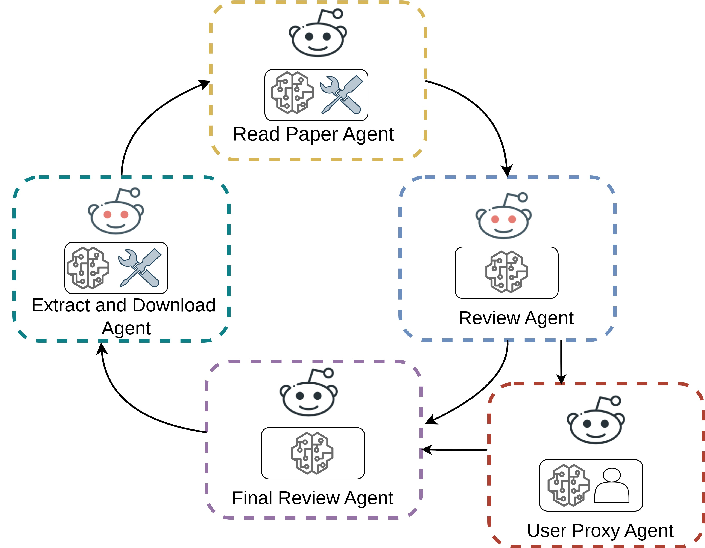
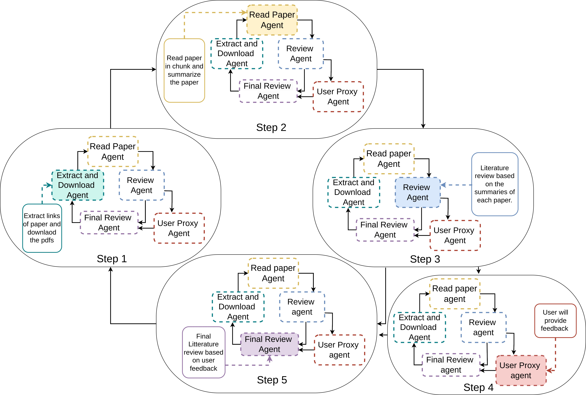

# Literature Review using Multi-Agent System

This repository showcases a **Multi-Agent System** for automating the process of writing a literature review from academic papers. The system leverages multiple specialized agents to:

- Download research papers from  provided links
- Extract and summarize content in chunks
- Generate a structured 500-word literature review
- Incorporate user feedback for final refinement

Built with [Autogen](https://github.com/microsoft/autogen), [Groq](https://groq.com/), and multi-agent coordination.

<div style="text-align: center;">
    
</div>

## Step 1: Install and configure all the necessary packages.
 ```sh

!pip install PyPDF2 pdfplumber pytesseract pdf2image Rouge textstat scikit-learn arxiv
!pip install autogen autogen_ext autogen_agentchat
!pip install --upgrade opentelemetry-sdk
import requests
from getpass import getpass
import asyncio
import os
import time
import pdfplumber
import pytesseract
import openai
from pdf2image import convert_from_path
from bs4 import BeautifulSoup
from autogen import UserProxyAgent, AssistantAgent, GroupChat, GroupChatManager
from sklearn.feature_extraction.text import TfidfVectorizer
from sklearn.metrics.pairwise import cosine_similarity
from getpass import getpass
from autogen_agentchat.agents import AssistantAgent
from autogen_agentchat.conditions import TextMentionTermination
from autogen_agentchat.teams import RoundRobinGroupChat
from autogen_agentchat.ui import Console
from autogen_core.tools import FunctionTool
from autogen_ext.models.openai import OpenAIChatCompletionClient
from autogen_agentchat.messages import TextMessage
from autogen_core import CancellationToken
```

## Step 2: Setup Groq API
```sh
tokenGROQ = getpass('Enter GROQ_API_KEY here: ')
os.environ["GROQ_API_KEY"] = tokenGROQ
print(os.environ.get("GROQ_API_KEY"))
```

## Step 3: Connect to LLM and test the LLM

```sh
#Connect the LLM
model_client = OpenAIChatCompletionClient(
    model="gemma2-9b-it",
    base_url="https://api.groq.com/openai/v1",
    api_key=os.environ.get("GROQ_API_KEY"),
    model_info={
        "vision": False,
        "function_calling": True,
        "json_output": False,
        "family": "unkown",
    },
)

#Test the LLM
async def Agent_tool(query: str) -> str:
    return "A multi-agent system is a framework where multiple agents interact, collaborate, or compete to solve complex tasks or achieve individual goals."

agent = AssistantAgent(
    name="assistant",
    model_client=model_client,
    tools=[Agent_tool],
    system_message="You solve the task using tools.",
)
async def assistant_run() -> None:
    response = await agent.on_messages(
        [TextMessage(content="Find information on Multi-Agents", source="user")],
        cancellation_token=CancellationToken(),
    )
    print(response.inner_messages)
    print(response.chat_message)

await assistant_run()
```
## Step 4: Create methods

#### 4.1 Use extract_and_download_pdfs()
Create method extract_and_download_pdfs() which will extract pdf links and download the papers from these link.
```sh

def extract_and_download_pdfs(save_dir: str = "research_papers"):
    #Extracts PDF URLs for each paper from Arxiv pages using paper links and downloads them.

    # Multi-Agent LLM Systems papers link 
    PAPER_URLS = [
        "https://arxiv.org/abs/2306.03314",
        "https://arxiv.org/abs/2406.13693",
        "https://arxiv.org/abs/2309.17288v1",
        "https://arxiv.org/abs/2402.15538",
        "https://arxiv.org/abs/2402.11550",
        "https://arxiv.org/abs/2311.13884"
    ] """

    #Create the directory if it doesn't exist
    if not os.path.exists(save_dir):
        os.makedirs(save_dir)

  #Track already downloaded papers
    downloaded_papers = set()
    for paper_url in PAPER_URLS:
        try:
            #Extract the titles and pdfs of paper
            response = requests.get(paper_url)
            if response.status_code != 200:
                print(f"Failed to fetch {paper_url}, status code: {response.status_code}")
                continue

            soup = BeautifulSoup(response.text, 'html.parser')

            # Extract the paper title
            title = soup.find('h1', class_='title').text.strip().replace('Title: ', '').replace('/', '-')
            pdf_url = paper_url.replace('abs', 'pdf') + ".pdf"  # Modify the URL to point to the PDF

            # Title use as a filename of paper
            title_paper = f"{title}.pdf"
            save_path = os.path.join(save_dir, title_paper)

            if save_path in downloaded_papers:
                print(f"File already downloaded: {save_path}")
                continue

            # Download the paper pdf
            response_pdf = requests.get(pdf_url, stream=True)
            if response_pdf.status_code == 200:
                print(f"Saving {title} to: {save_path}")
                with open(save_path, 'wb') as file:
                    for chunk in response_pdf.iter_content(1024):
                        file.write(chunk)
                print(f"Downloaded: {save_path}")
                downloaded_papers.add(save_path)  # Add the paper to the set of downloaded papers
            else:
                print(f"Failed to download {pdf_url}, status code: {response_pdf.status_code}")
        except Exception as e:
            print(f"Error downloading {paper_url}: {e}")

    return list(downloaded_papers)

# testing the methods
#downloaded_files = extract_and_download_pdfs(save_dir="research_papers")
#print(f"Downloaded files: {downloaded_files}")
```

### 4.2 Use summarize_all_pdfs() 
summarize_all_pdfs function will read the paper in chunks and summarize all papers
```ssh

client = openai.OpenAI(
    base_url="https://api.groq.com/openai/v1",
    api_key=os.environ.get("GROQ_API_KEY")
)

def extract_text_from_pdf(pdf_path: str) -> str:
    #Use pdfplumber to extracts text from a PDF file and applies OCR if needed.
    text = ""

    try:
        with pdfplumber.open(pdf_path) as pdf:
            if pdf.metadata and "Encrypted" in pdf.metadata:
                return "PDF is encrypted. Cannot extract text."

            for page in pdf.pages:
                extracted_text = page.extract_text()
                if extracted_text:
                    text += extracted_text + "\n"

        # Apply OCR if text was not extracted
        if not text.strip():
            print(f"Applying OCR to {pdf_path} (scanned document detected)...")
            images = convert_from_path(pdf_path)
            for img in images:
                ocr_text = pytesseract.image_to_string(img)
                text += ocr_text + "\n"

        return text if text.strip() else "No extractable text found."
    except Exception as e:
        return f"Error extracting text: {e}"


def chunk_text(text: str, max_length: int = 13000) -> list:
    #Split long text into small chunks
    chunks = []
    current_chunk = ""

    for line in text.split():
        temp_chunk = current_chunk  + line
        if len(temp_chunk) <= max_length:
            current_chunk = temp_chunk
        else:
            if current_chunk:
                chunks.append(current_chunk)
            current_chunk = line

    if current_chunk:
        chunks.append(current_chunk)

    return chunks


def summarize_with_groq(chunk: str) -> str:
    """Summarizes a chunk of text using Groq's LLaMA API."""
    try:
        response = client.chat.completions.create(
            model="gemma2-9b-it",
            messages=[
                {"role": "system", "content": "Shortly Summarize the following text precisely not more than one paragraph while keeping the main idea and start each paper with new line"},
                {"role": "user", "content": chunk}
            ],
            temperature=0.3
        )
        return response.choices[0].message.content
    except Exception as e:
        return f"Error summarizing chunk: {str(e)}"


def summarize_chunks(chunks: list) -> list:
    """Summarizes each chunk using Groq's LLaMA API."""
    summaries = []
    for idx, chunk in enumerate(chunks):
        summary = summarize_with_groq(chunk)
        summaries.append(summary.strip())
        # Avoid hitting API rate limits
        time.sleep(6)
    return summaries


def summarize_text(pdf_path: str) -> str:
    """Finds a PDF, extracts text, chunks it, and generates a summary."""
    pdf_name = os.path.basename(pdf_path)  # Get the PDF name

    extracted_text = extract_text_from_pdf(pdf_path)
    if not extracted_text or "extractable text found" in extracted_text:
        return f"No extractable text found in {pdf_name}."

    chunks = chunk_text(extracted_text, max_length=13000)
    print(f"Divide in chunk and read paper {pdf_name}: {len(chunks)}")

    chunk_summaries = summarize_chunks(chunks)
    summary = "\n".join(chunk_summaries)

    return f"Summary for {pdf_name}:{summary}"


def summarize_all_papers(pdf_files: list) -> list:
    """Summarizes all downloaded PDFs."""
    all_summaries = []
    for pdf_path in pdf_files:
        summary = summarize_text(pdf_path)
        all_summaries.append(summary)
    return all_summaries

#test the methods extraxt links and download and provide chunked summaries

#downloaded_files = extract_and_download_pdfs(save_dir="research_papers")
#print(f"Downloaded files: {downloaded_files}")

#all_summaries = summarize_all_papers(downloaded_files)

# Output all summaries
#print(f"All Summaries:")
#for summary in all_summaries:
#    print(summary)
```

## Step 5: Setup the required tools.
```sh
#Tool to download the PDF file from the given URL

Extract_download_pdf_tool = FunctionTool(
    extract_and_download_pdfs,
    description="Downloads a PDF and saves it to a defined path as /content/research_papers/."
)

# Tool to summarize the chunks of papers
Read_Summarize_tool = FunctionTool(
    summarize_all_papers,
    description="You are doing chunked summaries of all papers to understand the paper. Your main task is provide summary of each paper."
)
```
## Step 6: Build the required agents.
To visually represent how each agent works and interacts in  multi-agent literature review system, you can use a diagram:
<div style="text-align: center;">
    
</div>


### 6.1 Extract and Download Agent: 
This agent is responsible to extract and download papers with paper title.

# Download Agent
```sh
Extract_and_Download_Agent = AssistantAgent(
    name="Extract_and_Download_Agent",
    model_client=model_client,
    tools=[Extract_download_pdf_tool],
    description="This agent downloads research papers from provided Arxiv links. If papers are already downloaded, it confirms and exits.",
    system_message=(
        """
        You are a helpful AI assistant. Solve tasks using your tools.
        You are responsible for downloading research papers from given Arxiv links.
        """
    ),
)

```

### 6.2 Read and Summarize paper Agent: 
This agent will read all papers one by one and read paper in chunks and summarize it to use it for literature review.
```sh
Read_and_Summarize_Papers_Agent = AssistantAgent(
    name="Read_and_Summarize_Papers_Agent",
    tools=[Read_Summarize_tool],
    model_client=model_client,
    description=(
        "This agent processes research papers one by one and read paper in chunks and generates summary of each paper separatly using the provided summarization tool."
    ),
    system_message=("""You are a helpful AI assistant. Solve tasks using your tools.Your task is to process each paper in the designated directory,and provide a clear, concise summary for each paper."""
    ),
)
```

### 6.3 Review Agent: 
This agent will produce literature review from the summaries of the papers.
```sh
Review_Agent = AssistantAgent(
    name="Review_Agent",
    model_client=model_client,
    description="This agent generates a well-structured literature review based on summaries of 500 words.",
    system_message=(""" You are an expert in writing literature reviews.Take the summaries of the papers and write a comprehensive 500-word literature review.Structure the review paragraphs, with each paragraph explaining a specific aspect of the topic and summarizing key insights from all the provided papers."""
    ),
)
```
### 6.4 User Proxy Agent: 
This agent will take user suggestions.
```sh
User_Proxy_Agent = UserProxyAgent(
    name="User_Proxy_Agent",
    input_func=input,
    description="This agent allows the user to interact and provide feedback during the literature review process."
)
```

### 6.5 Final Review Agent: 
This agent will refine the review based on user input and save it in file.
```sh
Final_Review_Agent = AssistantAgent(
    name="Final_Review_Agent",
    model_client=model_client,
    description="This agent refines and finalizes the literature review based on user feedback.",
    system_message=("You are a helpful assistant. Once the user provides corrections or modifications, refine the review generated by Review_Agent accordingly. And make sure total number of words must be 500."
    ),
)
####Some time correct prompt will not give the correct literature review you can use the prompt defined as below
#You are an expert in writing literature reviews. write a comprehensive 500-word literature review. Structure the review paragraphs, with each paragraph explaining a specific aspect of the topic and summarizing key insights from all the provided papers.
#You are responsible for creating a literature review based on the final summaries. Integrate key findings from all papers into a cohesive, well-organized 500-word review. and make sure that words must be 500-word."
```

## Step 7: 
Implement max termination In this step, implement MaxMessage termination with 6 max_messages.

```sh
termination = MaxMessageTermination(max_messages=6)
```
## Step 8: Group Chat 
For communication between agents implement RoundRobinGroupChat.from autogen_agentchat.teams import RoundRobinGroupChat
```sh
team = RoundRobinGroupChat(
    [Extract_and_Download_Agent, Read_and_Summarize_Papers_Agent, Review_Agent, User_Proxy_Agent, Final_Review_Agent],
    termination_condition=termination,
)
task = "Write a Literature Review on Multi-Agent LLM systems research papers and it must be 500-words"

await Console(team.run_stream(task=task))
```
